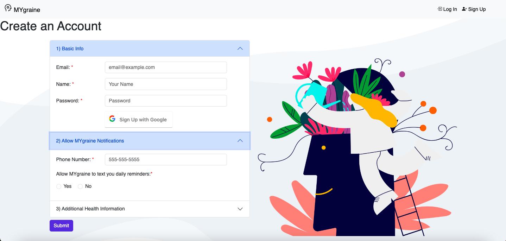

# MYgraine

## _Hackbright Capstone Project_

MYgraine is a headache tracking web application that reminds users to log their headaches and visualizes data with a calendar and charts, helping users understand their health and prevent future attacks.

## Table of Contents

- 🤖 Technologies
- 🌟 Features
- 📖 Set Up
- 🙋🏻‍♀️ About Me


## Technologies
Category | Tech
--- | --- 
**Backend** | [Python], [Flask], [Postgresql], [SQLAlchemy]
**Frontend** | [JavaScript] (AJAX, JSON), [Jinja2], [HTML], [CSS], [Bootstrap] 
**Libraries** | [FullCalendar], [Chart.js], [jQuery]
**API** | [Twilio], [Google OAuth], [Inspiration Quote]
**Other** | [Canva]

## Features
- Add headaches and log possible triggers, medications taken, and other health information.
- Schedule daily text reminders at a specific time to be reminded to log headaches.
- View, select, and delete logged headache events from a calendar.
- View personal trigger data on profile and on a chart.
- Enable Dark Mode for better visual comfort during a headache.
- Create an account and log in with Google Account.

## Demo
Full Demo Video Coming Soon!
<br>

Log in with Google and schedule reminder notifications:

<br><br>
User Profile:

<br><br>
Log Headaches:
<br><br>

<br><br>

<br><br>
Clickable Calendar:
<br><br>

<br><br>
Dark Mode:
<br><br>


## Set Up

To run this project, first clone or fork repository.

```bash
    git clone https://github.com/BrianaBroussard/MYgraine.git

```

Create and activate a virtual environment inside your directory.

```bash
    virtualenv env
    source env/bin/activate

```

Once in the virtual environment, install all required depenencies.

```bash
    pip3 install -r requirements.txt

```

Sign up to obtain keys for the Twilio API.
Save the keys in a file called secrets.sh using this format.

```bash
    export account_sid="YOUR_KEY_GOES_HERE"
    export auth_token="YOUR_TOKEN_GOES_HERE"
    export message_service_sid="YOUR_SID_GOES_HERE"
    export twilio_number="YOUR_NUMBER_HERE"

```

Sign up to obtain keys for Google OAuth API.
Save the keys in a file called secrets.sh using this format.

```bash
    export google_client_id="YOUR_ID_GOES_HERE"
    client_secret="YOUR_CLIENT_SECRET_GOES_HERE"

```

Source your keys into your virtual environment.

```bash
    source secrets.sh

```

Next, create and seed a database for the project. You will need [PostgreSQL] installed for this.
```sh
python3 seed_database.py
```

Run the app:

```bash
    python3 server.py
```

Edit your job.sh file:

```bash
#sets virtual env for cron tab
source ABSOLUTEPATH/env/bin/activate

#sourcing twilio keys in secrets.sh
source ABSOLUTEPATH/secrets.sh

#run twilio program to notify users
python ABSOLUTEPATH/send_sms.py
```

To run Twilio notifications daily set a cron job to call job.sh at midnight:

```bash
crontab -e 
   0 0 * * * cat ABSOLUTEPATH/job.sh 
```

## About Me

Hi my name is Briana Broussard. I was previously an Optometrist before becoming a Full-Stack Software Engineer. I am passionate about healthcare and technology and look forward to connecting with you!
<br>
Find me on [Linkedin]


[Python]: <https://www.python.org/>
[Flask]: <https://flask.palletsprojects.com/en/2.1.x/>
[Postgresql]: <https://www.postgresql.org/>
[SQLAlchemy]: <https://www.sqlalchemy.org/>
[JavaScript]: <https://developer.mozilla.org/en-US/docs/Web/JavaScript>
[HTML]: <https://developer.mozilla.org/en-US/docs/Web/HTML>
[CSS]: <https://developer.mozilla.org/en-US/docs/Web/CSS>
[Bootstrap]: <https://getbootstrap.com/>
[jQuery]: <http://jquery.com>
[Google OAuth]: <https://developers.google.com/identity/protocols/oauth2>
[Jinja2]: <https://jinja.palletsprojects.com/en/3.1.x/>
[Canva]: <https://www.canva.com/>
[PostgreSQL]: <https://www.postgresql.org/>
[FullCalendar]: <https://fullcalendar.io/docs>
[Chart.js]: <https://www.chartjs.org/docs/latest/>
[Twilio]: <https://www.twilio.com/docs>
[Inspiration Quote]: <https://api.goprogram.ai/inspiration/docs/>
[Linkedin]: <https://www.linkedin.com/in/brianabroussard/>